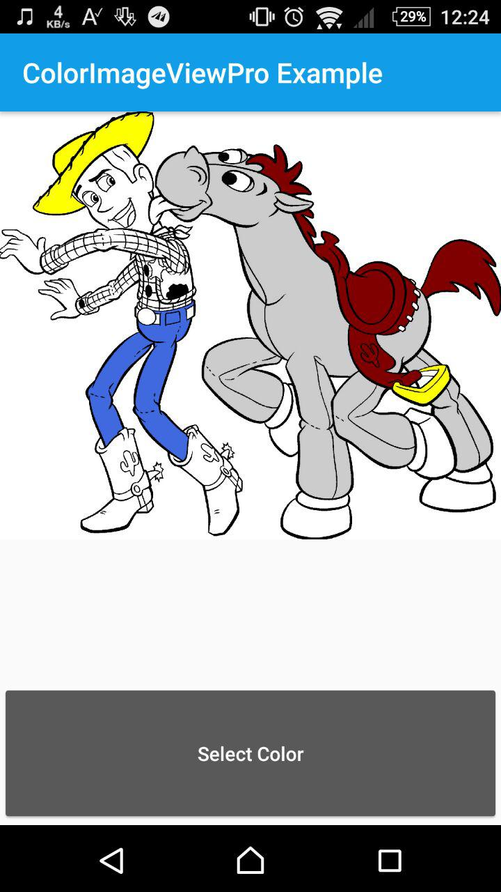

# Coloring-for-kids
Coloring-for-kids
Update at 12 Dec 2016

## ScreenShot

## Usage
<pre>
  private Handler handler = new Handler() {
    @Override
        public void handleMessage(Message msg) {
        }
  };
</pre>

<pre>
 mPaintView.post(new Runnable() {
    @Override
        public void run() {
            mPaintView.loadFromBitmap(bitmap,handler);
        }
});
</pre>

<pre>
  mPaintView().setPaintColor(Color);
</pre>
